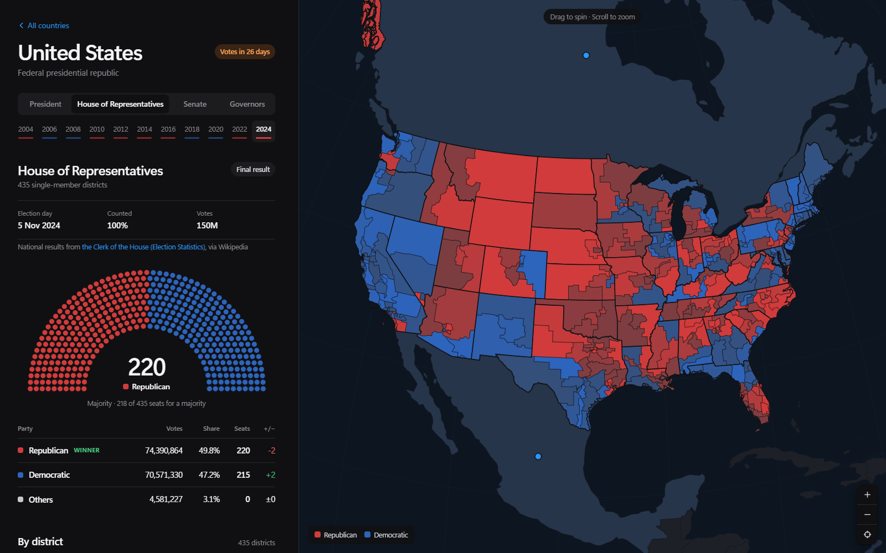

# Election Tracker

A draggable globe of national elections in 50 countries: the US, Canada, Mexico,
Brazil, Argentina, Chile, Colombia, Peru and Bolivia; the UK, Ireland, France, Spain,
Portugal, Italy, Germany, Austria, Switzerland, the Netherlands, Belgium, Denmark,
Norway, Sweden, Finland, Poland, Czechia, Slovakia, Hungary, Romania, Greece, Ukraine
and Russia; Türkiye, Iran, Iraq, India, Thailand, Malaysia, Indonesia, the
Philippines, South Korea and Japan; Morocco, Nigeria, DR Congo, Kenya, Botswana and
South Africa; and Australia and New Zealand. Pick a country and the globe flies in and
colours it by who won, shaded by margin: by state, province or region, and for
chambers elected in single-member seats, by official district (US congressional
districts, UK and French constituencies, Canadian ridings, Australian divisions,
German Wahlkreise, Indian Lok Sabha seats and Japanese districts). The side panel
shows the national result, the breakdown, the closest races, past results and how the
system works. Results are as of the date at the top of `data/index.json` (`asOf`),
shown on the home page.



National totals are official results in every country, and the page names the
source under each one. Each lists every party that won a seat, took at least 1% of the
vote or lost five or more seats, and sums the rest into Others. Where the source says
who won each state or region, the map uses it and the page says so. For the US House
and the UK and Canadian lower houses, the result in every district is real, for today's
election and back to 2012, 2010 and 2015 respectively, each drawn on the boundaries of
its time. For the
Australian and Spanish lower houses, the seats each party took in each state or
community are real. The rest of the state, region and district detail is sample data.
No API is used for results or race calls.

The tracker also has every national election since 1948 for each office it shows, in
every country. See [Past elections](#past-elections).

## Run it

```
python -m http.server 5280
```

Then open http://localhost:5280. Any static file server works. There's no build step
for local use. D3, TopoJSON and the world outline are copies in `js/vendor/` and
`data/`, so the page makes no requests to other hosts (licences in
`js/vendor/LICENSES.md`). If you change a JS file while the page is open, hard refresh,
because the Python server lets the browser cache modules. The scripts in `scripts/`
need Node 22 or later.

## Deploying

`vercel.json` deploys the site to Vercel as static files. Its build command,
`npm run build`, runs `scripts/stamp.mjs`. That script copies the site into `dist/` and
adds a hash of each file's contents to the file's URL (`js/app.js?v=dfbfec6dd7`).
Browsers cache those URLs for a year, so a returning visitor downloads only the code,
maps and results that changed since their last visit. A changed file gets a new hash,
so no one keeps an old copy. `index.html` and `data/live/` are checked on every
request. To try a build locally, run `npm run build` and open
http://localhost:5280/dist/.

Link previews use `img/og.png`. Their image URL has to be absolute, so the build fills
in the production domain from Vercel's `VERCEL_PROJECT_PRODUCTION_URL`. `vercel.json`
also sets a few security headers: no MIME sniffing, a referrer policy, and no
embedding in frames.

Vercel serves static files, so nothing there writes `data/live/`. A deployed copy shows
the results as of `asOf` until you update the data and redeploy. Live counts need a host
where the cron below can write files.

## Live updates

The page reads `data/live/index.json` once when it opens. After that it checks for
results only on election night:

- **When:** from the time polls close in that country (`pollsClose` in the schedule,
  in the election's own time zone) for as long as the count runs.
- **How often:** every two minutes.
- **Which country:** only the country on screen; from the home page, each country that
  is counting.

On other days, on other countries' pages and in hidden tabs it makes no requests.
When a live file disappears, the page reloads that country's file to pick up the
final result.

## Layout

```
index.html                  shell: top bar, side panel, globe pane
css/style.css               all styling, light and dark
img/og.png                  link preview image
js/app.js                   boot, hash router (#/, #/US, #/US/us-senate-2024), live polling
js/globe.js                 canvas orthographic globe: drag, inertia, zoom, fly-to, hit-testing, layers
js/world.js                 loads outlines, regions and districts, with level-of-detail copies
js/home.js                  home panel: next vote, calendar, roster, latest results
js/country.js               country panel: results, regions and districts, history, and an election-night replay with ?debug
js/charts.js                seat chamber, head-to-head bar, history bars, polling chart
js/data.js                  loaders; overlays data/live onto data/countries
js/status.js                live / today / soon / scheduled per country
js/vendor/                  D3 and TopoJSON, with their licences
data/index.json             tracked countries, globe camera, region and district wording
data/schedule.json          upcoming elections; the cron reads this
data/countries/*.json       parties, results, regions, districts, system facts
data/regions.topo.json      state/province shapes keyed like "US-OH"
data/districts/*.topo.json  single-member districts keyed like "US-CA-12"; earlier boundary sets as US.cd113.topo.json
data/world-coarse.topo.json world-atlas 110m, the zoomed-out globe (Crimea and Western Sahara redrawn)
data/world-detail.topo.json lighter cut of world-atlas 50m for country zoom
data/sources.json           official results authority and district map source per country
data/live/index.json        which countries have a live file (kept by the cron)
data/live/*.json            written by the cron on election day only
data/history/*.json         past elections with illustrative results by region (built)
data/history/districts/     real results by district for past elections, loaded when one is opened (built)
scripts/history/*.json      past national results, read from Wikipedia's results tables
scripts/history/districts/  results by district for each election since 2010, from the official sources
scripts/district-results/   downloads and parses those results; cd117.mjs makes the 2020 US map
scripts/check-history.mjs   checks scripts/history before a build
scripts/verify-history.mjs  finds every vote count in the cited Wikipedia revision
scripts/check-current.mjs   checks generated maps against national and sourced results
scripts/due.mjs             lists elections that have happened but have no results yet
scripts/wiki/               fetches articles by revision, parses results tables, looks up party colours
docs/REFRESH.md             how results are refreshed after an election
scripts/build-history.mjs   builds data/history from scripts/history
scripts/regions.mjs         region results and regional-party rules, shared by mock-data and build-history
scripts/update-results.mjs  cron entry point
scripts/stamp.mjs           deploy build: dist/ with content-hashed URLs
vercel.json                 Vercel build settings, cache and security headers
scripts/calls.mjs           the tracker's call rules
scripts/adapters/mock.mjs   the feed in use: replays the last result as a live count
scripts/adapters/ap.mjs     Associated Press client, kept but not connected
scripts/adapters/tse.mjs    Brazil electoral court client, kept but not connected
scripts/build-regions.mjs   rebuilds regions.topo.json from Natural Earth
scripts/build-districts.mjs rebuilds data/districts from each country's boundary file
scripts/build-world.mjs     rebuilds both world files from world-atlas 50m and 110m
scripts/seeds.mjs           national figures for the countries and chambers added later
scripts/districts.mjs       district results: the real ones, or a sample that adds up to the national seats
scripts/mock-data.mjs       regenerates all sample detail
```

## Data shape

An election in `data/countries/<CODE>.json`:

```json
{
  "id": "us-house-2024",
  "office": "House of Representatives",
  "kind": "presidential | legislative | gubernatorial",
  "date": "2024-11-05",
  "status": "final | live",
  "reporting": 100,
  "totalSeats": 435, "majority": 218, "seatLabel": "Seats",
  "candidates": [{ "name", "party", "votes", "pct", "seats", "change", "winner", "advanced", "short" }],
  "call": { "status": "runoff", "parties": ["pl", "pt"], "by": "the Superior Electoral Court" },
  "regions": [{
    "name": "Ohio", "abbr": "OH", "contested": true, "winner": "gop",
    "margin": 17.7, "turnout": 54.1, "votes": 2097363, "seats": 15,
    "results": [{ "party": "gop", "pct": 58.3, "votes": 1222763, "seats": 10 }]
  }],
  "districts": [{
    "abbr": "OH-9", "name": "Ohio 9th", "region": "OH", "winner": "dem", "margin": 0.6,
    "results": [{ "party": "dem", "pct": 48.3, "votes": 152114 }]
  }],
  "rounds": [{ "label", "date", "candidates", "regions" }],
  "history": [{ "year": 2022, "winner": "gop", "results": [{ "party", "pct", "seats" }] }],
  "cite": { "name": "the Clerk of the House (Election Statistics)", "url": "https://en.wikipedia.org/wiki/…" },
  "statesFrom": "https://en.wikipedia.org/wiki/…",
  "districtsFrom": { "name": "Wikipedia", "url": "https://en.wikipedia.org/wiki/…" },
  "chamberSize": 257
}
```

A first round whose run-off is still to come has `call.status` "runoff", with the two
candidates going through flagged `advanced` (`short` is an optional short name, such as
"Lula"). `cite` names the source of the national figures. `statesFrom` is set when region
winners come from a source rather than the sample generator, and `districtsFrom` when the
district results are real. `chamberSize` is set when `totalSeats` counts only the seats
that were up (Argentina's half renewals).

A past election with real district results carries `districtSet` (`"cd113"`) and
`districtsFrom` in `data/history/<CODE>.json`. Its districts are in
`data/history/districts/<id>.json`, fetched when the election is opened, and are drawn on
`data/districts/<CODE>.<set>.topo.json`. A district whose result was voided (North
Carolina's 9th in 2018) has `voided: true` and no winner.

A region's `abbr` matches the suffix of its shape id in `regions.topo.json`, and a
district's `abbr` the suffix of its id in `data/districts/<CODE>.topo.json`. When
`contested` is false the globe hatches the region as having no race. During a live
count a region or district has a `leader` but no `winner` until it is called. The
country file also carries `about` (system facts per office), and `polls` only for real
polling series, each with a `source`.

A live file (`data/live/US.json`) is `{ code, updatedAt, elections: [...] }` in the
same shape. The page overlays it by election id, so it can update an existing race or
add this year's race on top of the last one.


## District maps

| Country | Districts | Source | Licence |
|---|---|---|---|
| US | 435 | US Census Bureau, 119th Congress cartographic boundaries | Public domain |
| UK | 650 | ONS, Westminster constituencies (July 2024) | Open Government Licence v3.0 |
| Canada | 343 | Elections Canada, 2023 Representation Order | Open Government Licence – Canada |
| Australia | 150 | ABS, Commonwealth Electoral Divisions 2025 | CC BY 4.0 |
| Germany | 299 | Die Bundeswahlleiterin, Wahlkreise 2025 | dl-de/by-2-0 |
| France | 539 | data.gouv.fr circonscriptions (metropolitan) | Licence Ouverte 2.0 |
| India | 543 | DataMeet parliamentary constituencies | CC0 |
| Japan | 289 | japan-choropleth, 2022 districts | Public-domain source data |

Ireland is broken down by its 43 Dáil constituencies rather than counties, since that
is where votes are counted (Tailte Éireann, Constituency Boundaries 2023, CC BY 4.0).

Earlier boundary sets, for past elections:

| Set | Elections | Source | Licence |
|---|---|---|---|
| US cd113 | 2012, 2014 | US Census Bureau, 113th Congress cartographic boundaries | Public domain |
| US cd115 | 2016 | US Census Bureau, 115th Congress cartographic boundaries | Public domain |
| US cd116 | 2018 | US Census Bureau, 116th Congress cartographic boundaries | Public domain |
| US cd117 | 2020 | The 116th Congress file with North Carolina's 2019 plan (NC General Assembly, HB 1029) | Public domain; public record |
| US cd118 | 2022 | US Census Bureau, 118th Congress cartographic boundaries | Public domain |
| UK 2010 | 2010–2019 | ONS, Westminster constituencies (December 2019) | Open Government Licence v3.0 |
| Canada 2013 | 2015–2021 | Elections Canada and NRCan, 2013 Representation Order | Open Government Licence – Canada |

North Carolina voted in 2020 on a court-ordered map that no Census file has, so
`scripts/district-results/cd117.mjs` swaps the enacted plan's shapefile into the 116th
Congress file, clipped to the same coastline.

Notes: the US file predates the 2025 mid-decade redraws used for 2026. France's
overseas and expatriate seats aren't drawn. India's Assam and Jammu and Kashmir show
boundaries from before the 2023 delimitation. Japan has no official government
download, so its file is a compilation of public-domain data. Country and state
outlines come from Natural Earth and world-atlas (public domain).

District results for the US House, the UK Commons and the Canadian House are real; see
[Past elections](#past-elections) for their sources. Elsewhere, sample district results
are fitted so every party's districts add up to its national seat total, state by state.
For Australia, each state's seats by party are the real ones (`SEAT_SPLITS` in
`scripts/mock-data.mjs`), and only which divisions they fall in is sample data. Regional
parties only win where they stand (India's state parties, Katter's in Queensland, the
SVP in South Tyrol and so on; the list is `REGIONAL` in `scripts/regions.mjs`), and each
party's seats cluster geographically.

## Past elections

Every country has every national election since 1948 for each office it shows, 1,573 in
all. On a country page, pick a year on the rail under the office tabs (each year is marked
in the winner's colour), or a row under Past results. A past election opens like the
current one, with its seat chart, full results and the globe painted by region, at its
own address (`#/IT/it-chamber-1948`).

**National results** are in `scripts/history/<CODE>.json`: each party's votes, share,
seats and seat change, read from the results table in the election's Wikipedia article,
which reproduces the official results. Each election records the article and the
revision it was read from. `scripts/check-history.mjs` checks that seats add up to the
chamber, shares to about 100%, that there is one winner, and that every party and
region exists. Each party's vote count was also found digit for digit in the cited
revision, apart from rows the tracker sums itself (Australia's Coalition, Canada's
independents, a few merged rows) and Others.

**Results by region** are illustrative. Borders and units have changed since 1948, so
`scripts/build-history.mjs` draws each region's result from the national split on
today's map. Where the source has a results-by-region table that matches today's units,
the real winner of each region is used (`regionWinners`), and the page says so; when only
some regions have one, it says how many.
Regional parties are kept to the regions they stood in (`RULES` in the same script).
Regions show a winner and shares only, with no vote counts, so nothing generated looks
like a real count.

**Results by district** are real for the US House since 2012, the UK Commons since 2010
and the Canadian House since 2015, and each election is drawn on the boundaries in force
at the time. Pick 2016 and the map shows the districts of 2016. The results come from:

- US: the district tables in Wikipedia's article on each House election, pinned to a
  revision. Each district has its winner and every listed candidate's share; where the
  article lists only some candidates, the rest is shown as Others. A Louisiana run-off or
  a ranked-choice count is shown at its final round.
- UK: the UK Parliament election results service (`candidacies.csv`), with votes.
- Canada: Elections Canada's official voting results (table 12), with votes.

`scripts/history/districts/<id>.json` holds them, and `scripts/check-history.mjs` checks
that every district of the boundary set has one result, that each winner is its
district's largest party, and that the wins add up to the national seats. They do, in
every election. Independents count separately, so two independents in one seat never
outpoll its winner. North Carolina's 9th in 2018 shows as voided: the result was thrown
out for fraud and the seat stayed empty. Today's elections in the three countries use the
same files. To rebuild them and the boundary sets (the Natural Earth file is the one in
`scripts/build-regions.mjs`):

```
npm run district-results
npm run districts -- US .cache/district-results/us_cd113.zip --set=cd113
npm run districts -- US .cache/district-results/us_cd115.zip --set=cd115
npm run districts -- US .cache/district-results/us_cd116.zip --set=cd116
node scripts/district-results/cd117.mjs
npm run districts -- US .cache/district-results/us_cd117.json --set=cd117
npm run districts -- US .cache/district-results/us_cd118.zip --set=cd118
npm run districts -- GB .cache/district-results/gb_2010.geojson --set=2010
npm run districts -- CA .cache/district-results/ca_2013.zip --set=2013 --land=path/to/ne_10m_admin_1_states_provinces_lakes.geojson
npm run mock
npm run history
```

Where a source covers less than the whole chamber (France in 1958, metropolitan seats
only; South Africa in 1987 and 1989, the House of Assembly only), a note under the
election's title says so. Elections without real competition (Poland
1952–1985, Portugal's Estado Novo) are included with a note too. Regions that didn't
vote show no race (`partial` or `voted`): East Germany before 1990, most states in a
US Senate year. When a source gives only the seats won in a partial renewal
(Argentina), the chart reads "127 of 257 seats were up" instead of a majority line
(`chamberSize`). Rebuild after editing a history file:

```
npm run history
```

## Refreshing results

After each election, the steps in [docs/REFRESH.md](docs/REFRESH.md) add the official
results. They move the previous result into history, check every vote count against the
cited Wikipedia revision, and end in a pull request for review. They are run by hand for
now; `npm run due` lists the elections waiting for results.

## Rebuilding generated data

```
npm install
npm run regions -- path/to/ne_10m_admin_1_states_provinces_lakes.geojson --replace=IE=path/to/dail_constituencies_2023.geojson
npm run districts -- US path/to/cb_2025_us_cd119_20m.zip
npm run districts -- CA path/to/FederalElectoralDistricts.zip --land=path/to/ne_10m_admin_1_states_provinces_lakes.geojson
npm run world -- path/to/countries-50m.json path/to/countries-110m.json
npm run mock
npm run history
```

`districts` takes a country code and that country's boundary file from the table
above (shapefile zip or GeoJSON); the field mapping for each lives in
`scripts/build-districts.mjs`. `mock` rewrites all sample results and system
facts, adds sample past results only for offices without real ones, and leaves alone
any election that carries a `source`. One run is enough: each election is rebuilt until
the district maps stop changing its region winners.

## Performance

The globe is one canvas redrawn per frame. Shapes outside the visible cap are skipped,
shapes wholly on the visible side skip d3 altogether (each vertex's unit vector is
cached, so a frame is one rotation and scale per point), each layer keeps
level-of-detail copies so only about half a pixel of error is drawn, and shapes are
filled in batches by colour. Region shapes are prepared on the first hover over a tracked
country, so the first fly-in doesn't pause. Open the page with `?debug` and run `globe.benchmark()`
in the console for milliseconds per frame; `?debug` also shows the election-night replay.

## Licence

The code is MIT licensed; see [LICENSE](LICENSE). The data keeps its sources' terms.

National results are the electoral authorities' official figures, read from the
results tables in Wikipedia's election articles. Each election links its article and
the revision it was read from.

Results by district come from Wikipedia (US House), the UK Parliament election results
service (contains Parliamentary information licensed under the Open Parliament Licence
v3.0) and Elections Canada (Open Government Licence – Canada).

District and constituency boundaries are under the licences in the
[District maps](#district-maps) table. Their attribution statements:

- UK: Source: Office for National Statistics licensed under the Open Government Licence
  v.3.0. Contains OS data © Crown copyright and database right 2024. The December 2019
  constituencies, used for 2010 to 2019, are under the same licence.
- Canada: Contains information licensed under the Open Government Licence – Canada.
- Australia: Based on Australian Bureau of Statistics data, licensed under CC BY 4.0.
- Germany: © Die Bundeswahlleiterin, Wiesbaden, Datenlizenz Deutschland – Namensnennung –
  Version 2.0.
- France: data.gouv.fr, Licence Ouverte 2.0.
- Ireland: © Tailte Éireann, licensed under CC BY 4.0.

Country and state outlines come from Natural Earth and world-atlas (public domain).
